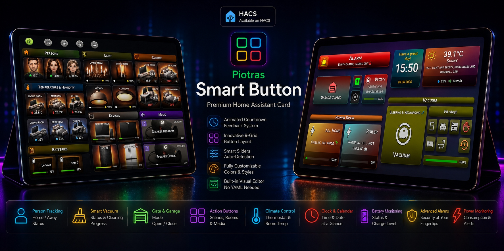
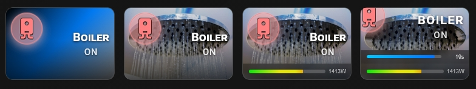
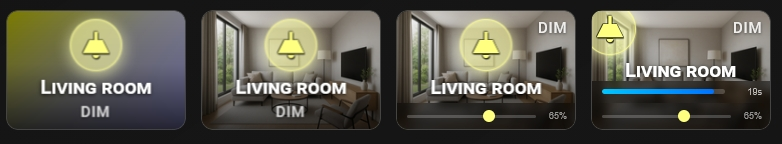
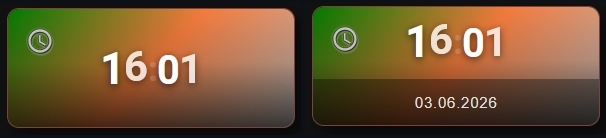
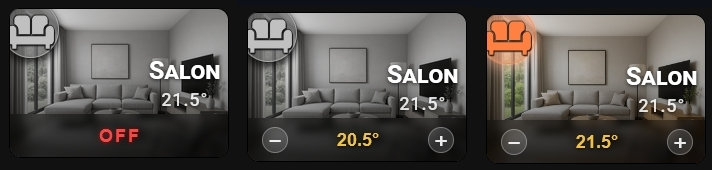
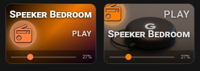
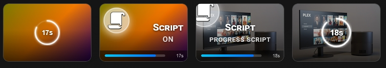
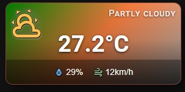
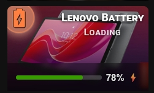
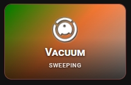

[](https://github.com/Piotras1/piotras-smart-button/releases)


[](https://github.com/Piotras1/piotras-smart-button/discussions/categories/show-and-tell)
[](https://github.com/Piotras1/piotras-smart-button/discussions)


[](https://github.com/Piotras1/piotras-cards-pack)
[](https://piotras1.github.io/piotras-cards-pack/smart-button-assets.html)
[](https://piotras1.github.io/piotras-cards-pack/mdi-icon-browser.html)
## Piotras Smart Button



---

## ✨ Features

<details>
<summary><b>🔍 Click here to view the full text-based features list (SEO & Indexing)</b></summary>

### 🚀 Complete Features Specifications

*   **🎨 Visual Editor (No YAML Needed)** — Full GUI configuration with native tabs: General, Size, Background, Icon, Text, Layout, Slider & Power, Filters, Actions, and Service.
*   **📐 9-Grid Layout System** — Position your Icon, Name, and State badge completely independently across a 3×3 matrix.
*   **🎛️ Adaptive Auto-Sliders** — Smart auto-detection for Brightness, Color Temperature, Volume, Cover Position, and Fan Speed.
*   **🖼️ Dynamic Backgrounds & Smart Filters** — Solid colors, 2/3-color gradients, or full-res images with automated CSS filters (brightness, saturation, grayscale) based on state.
*   **⏱️ Service Countdown System** — Animated SVG circle or progress bar after a call-service, with an optional card blockade.
*   **⚡ Power Monitoring & Pulsing Alerts** — Real-time consumption bar with a configurable pulsing warning threshold for power spikes.
*   **🚧 Gate & Garage Mode (New in v1.2.5)** — Specialized cover layout with dynamic directional arrows tracking opening/closing states.
*   **🕹️ Interactive Action Buttons (New in v1.2.5)** — Clickable sub-button grids embedded directly into the Control Zone for rooms, scenes, or media.
*   **👥 Person & Device Tracking** — Displays the precise time since the last state change inside the Control Zone with home/away icon colors.
*   **🔋 Battery Monitoring** — Dynamic icon auto-adjusted to charge level, color bars, and optional charging state integration.
*   **🌡️ Thermostat & Climate Control** — Dedicated temperature adjustment buttons in the Control Zone and real-time room temp as a state badge.
*   **🟢 Comfort Zone Engine** — Card shifts state and changes icon colors based on custom comfort ranges: blue (too cold/dry), green (comfortable), red (too hot/humid).
*   **🕒 Integrated Clock & Calendar (`on.clock`)** — Standalone digital timekeeper with a clean, multi-language monthly calendar grid.
*   **🌦️ Mini Weather Dashboard** — Compact layout showing temperature, conditions, theme-colored icons, humidity, and wind speed.
*   **🧹 Smart Vacuum Status** — Dedicated support for vacuums featuring a dynamic spinning icon during sweeping and hardware-brand mapping.
*   **🚨 Advanced Alarm Status** — Security monitoring for disarmed, arming, armed, and vacation states with dynamic pulsing animations.

</details>

---

## ⚙️ Installation

<details>
<summary><b>📦 Click here to view Installation Instructions (HACS & Manual)</b></summary>

### Method 1: Via HACS Store (Recommended)
1. Open HACS in Home Assistant
2. Search for **"Piotras Smart Button"** in the store
3. Click **Download**
4. Hard reload your browser (`Ctrl+Shift+R`)

### Method 2: Via HACS Link
1. Click the button below:

<a href="https://my.home-assistant.io/redirect/hacs_repository/?owner=Piotras1&repository=piotras-smart-button&category=plugin">
    
</a>

2. Click **Add** → **Download**
3. Hard reload your browser

### Method 3: Manual Installation

1. Download this repository as a ZIP file and extract it.
2. Inside your Home Assistant `config/www/` directory, create a new folder named `piotras-smart-button`.
3. Copy the compiled files (from `dist/` folder) into `config/www/piotras-smart-button/`.
4. Go to **Settings → Dashboards → Resources**.
5. Click **Add Resource** and enter:
```
/local/piotras-smart-button/piotras-smart-button-loader.js?v=1.2.4
```
- Resource type: **JavaScript Module**
6. Hard reload your browser (`Ctrl+Shift+R`).

</details>

--- 

## 🧩 The 9-Grid Layout System

Position Icon, Name, and State independently using a 3×3 grid (positions 1–9):


Elements sharing the same position are stacked vertically: `icon → name → state`.  
When `show_more: true` is active, elements in the bottom row shift up automatically to avoid the Control Zone.

```yaml
# Classic: icon top-left, name + state bottom-center
icon_mode: 1
name_mode: 8
value_mode: 8

# Centered stack (default)
icon_mode: 5
name_mode: 5
value_mode: 5
```

---

## 👤 Person & Device Tracker


For full features, layout settings, and ready-to-use YAML examples, check out the dedicated guide:
> 🔗 **[Detailed Person & Device Tracker Documentation](docs/WEATHER.md)**

---

## 🧭 Navigation Mode (Neumorphic Style)


For full features, layout settings, and ready-to-use YAML examples, check out the dedicated guide:
> 🔗 **[Detailed Navigation Mode Documentation](docs/NAVIGATION.md)**

---

## 🎛️ Socket & Power Monitoring



For full features, layout settings, and ready-to-use YAML examples, check out the dedicated guide:
> 🔗 **[Detailed Socket & Power Monitoring Documentation](docs/SOCKET.md)**

---

## 💡 Light & Auto-Dimmer Slider



For full features, layout settings, and ready-to-use YAML examples, check out the dedicated guide:
> 🔗 **[Detailed Light & Auto-Dimmer Documentation](docs/LIGHT.md)**

---

## 🕒📅 Clock & Calendar Display



For full features, layout settings, and ready-to-use YAML examples, check out the dedicated guide:
> 🔗 **[Detailed Clock & Calendar Documentation](docs/CLOCK-CALENDAR.md)**

---

## 🌡️ Thermostat



For full features, layout settings, and ready-to-use YAML examples, check out the dedicated guide:
> 🔗 **[Detailed Thermostat Documentation](docs/THERMOSTAT.md)**

---

## 🔊 Media Player



For full features, layout settings, and ready-to-use YAML examples, check out the dedicated guide:
> 🔗 **[Detailed Media Player Documentation](docs/MEDIA.md)**

---  

## 📜 Script Button



For full features, layout settings, and ready-to-use YAML examples, check out the dedicated guide:
> 🔗 **[Detailed Script Button Documentation](docs/SCRIPT.md)**

---

## 🚨 Advanced Alarm Status


For full features, layout settings, and ready-to-use YAML examples, check out the dedicated guide:
> 🔗 **[Detailed Advanced Alarm Status Documentation](docs/ALARM.md)**

---

## 🌤️ Mini Weather Card



For full features, layout settings, and ready-to-use YAML examples, check out the dedicated guide:
> 🔗 **[Detailed Mini Weather Card Documentation](docs/WEATHER.md)**

---

## 🔋 Battery



For full features, layout settings, and ready-to-use YAML examples, check out the dedicated guide:
> 🔗 **[Detailed Battery Card Documentation](docs/BATTERY.md)**

---

## 🌡️ Temperature & Humidity Comfort


For full features, layout settings, and ready-to-use YAML examples, check out the dedicated guide:
> 🔗 **[Detailed Temperature & Humidity Comfort Card Documentation](docs/TEMPERATURE.md)**

---

## 🧹 Smart Vacuum Status



For full features, layout settings, and ready-to-use YAML examples, check out the dedicated guide:
> 🔗 **[Detailed Smart Vacuum Status Card Documentation](docs/VACUUM.md)**

---

## 🎨 Icon Wrap Style


The icon_style option controls how the icon wrap looks — you can choose from 5 styles, from a classic colored badge to a clean borderless floating effect.

When icon_style is not set, the card defaults to circle_color — the classic colored circle you already know.

The icon wrap color always follows your icon_color (OFF state) and icon_color_on (ON state) settings regardless of the chosen style.

- **circle_color** — Circle with colored background and border. Classic, clear, works great on any card.
- **circle** — No background, no border. Just a soft drop shadow. The icon appears to float above the card — looks especially good on cards with a background image.
- **square_color** — Same as circle_color but with a rounded square shape. Great for a more structured dashboard layout.
- **square** — Rounded square with shadow only, no background or border.
- **none** — No wrap at all. Pure icon with no background, border or shadow. Perfect for minimalist cards or decorative buttons where the background image speaks for itself.

---

## ⚡ Service Countdown

When any action is set to `call-service` and `show_service: true` is enabled, the card displays an animated countdown for the duration set by `time_service`.

Two display styles:

| `service_style` | Description |
|---|---|
| `circle` *(default)* | Animated SVG ring centered on the card in `icon_color_on`. Only available when `entity` is not set and `show_more: false`. Ring diameter = `icon_wrap_size + 5px`. |
| `bar` | Progress bar docked at the bottom of the card. Works with any entity and is compatible with `show_more: true`. |

> **Note:** When using `entity` (e.g. a switch or socket) together with `show_more: true`, always use `service_style: bar`. The `circle` style requires an empty card without a power bar.

`time_service` supports two formats:
- `10` — countdown from 10 s, bar scale = 10 s
- `"10/20"` — countdown from 10 s, visual scale is 20 s (bar starts at 50%)

When `blockade_card: true` is set, re-triggering the service call is blocked for the entire countdown duration. All other tap actions (toggle, navigate, more-info) remain fully functional during this time.

```yaml
type: custom:piotras-smart-button
name: Boiler
icon: mdi:water-boiler
icon_color_on: "#ff6b35"
show_service: true
time_service: "30/60"
service_style: circle
blockade_card: true
tap_action:
  action: call-service
  service: switch.turn_on
  service_data:
    entity_id: switch.boiler
```

---

## ⚙️ Configuration Reference
**For the full list of parameters, check the:**
> 👉 [Configuration Reference Guide](docs/CONFIGURATION.md)


---

## 🖥 Visual Editor

The card ships with a full visual editor accessible directly in the Home Assistant dashboard UI. The editor automatically detects the entity domain and adjusts available options — for example, showing battery-specific fields for `sensor` with `device_class: battery`, thermostat controls for `climate`, comfort range fields for `temperature` and `humidity` sensors, or person tips for `person` / `device_tracker`.


Tabs available: **General · Size · Background · Icon · Text · Layout · Slider & Power · Filters · Actions · Service**

---

## 📄 License

MIT — free to use, modify, and share.

---

*Created by Piotras. Strictly engineered for reliability.*
