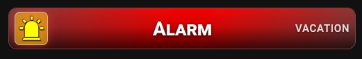
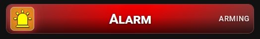
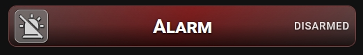

## 🚨 Advanced Alarm Status

Provide your standard Home Assistant alarm control panel entity (e.g., alarm_control_panel.home_alarm) to monitor your security system. This view focuses purely on rendering highly precise state feedback and visual security cues, while triggering actions open the native Home Assistant more-info dialog for secure PIN entry.





- Multi-state tracking — seamlessly fetches and displays native statuses including disarmed, arming, armed_home, armed_away, and triggered.
- Dynamic pulsing animations — critical or transitional states trigger smooth background pulsing and high-visibility icon shifts to capture immediate attention.
- Native HA translations — automatically inherits localized security terminology straight from Home Assistant's core backend, ensuring seamless multi-language compatibility.

```yaml
type: custom:piotras-smart-button
entity: alarm_control_panel.test_alarm
card_width: auto
icon_mode: 4
value_mode: 6
name: Alarm
name_size: 25
state_size: 13
icon_size: 40
icon_wrap_size: 42
card_height: 80
icon: mdi:alarm-light-off
icon_on: mdi:alarm-light
icon_color: "#d4d4d4"
icon_color_on: "#ff8000"
show_filter: true
tap_action:
  action: more-info
```

Looking for more inspiration or advanced configurations for Advanced Alarm Status? Check out these community guides:
 
> 💬 [Community Dashboards & Showcases (Show and Tell)](https://github.com/Piotras1/piotras-smart-button/discussions/categories/show-and-tell)

> 🔙 Back to the [Main README](../README.md)
