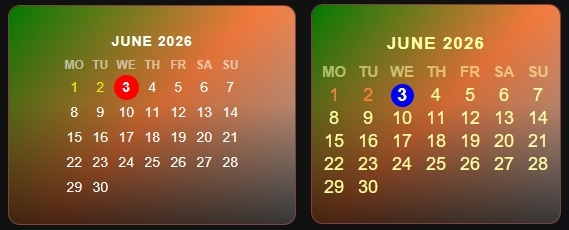

## 🕒 Clock Display

To activate the clock mode, simply pass on.clock into the entity field. The card transforms into an elegant digital clock, offering a clean, real-time hours and minutes display that fits perfectly into any dashboard layout.


- Dedicated virtual entity — uses **on.clock** to instantly switch the card into a standalone timekeeper.
- Real-time update — high-precision internal clock ensures the time is always accurate without stressing your HA database.
- Adaptive layout — text scaling and visual elements auto-adjust to maintain crisp legibility regardless of card size.

```yaml
type: custom:piotras-smart-button
entity: on.clock
icon_mode: 1
show_state: false
icon_wrap_size: 28
name_size: 40
icon: mdi:timetable
icon_style: none
show_more: true
```

---

## 📅 Calendar Grid

To activate the calendar grid, simply pass on.calendar into the entity field. It displays a compact monthly calendar overview directly inside the card, automatically handling day names and layout formatting while providing a clear visual indicator for the current date.



- Dedicated virtual entity — uses on.calendar to instantly switch the card into a standalone calendar grid.
- Multi-language support — localizes month and day headers automatically based on system settings.
- Current day highlight — applies a distinct visual badge to the current date for instant tracking.
- Grid optimization — clean 7-column layout engineered to fit beautifully inside standard grid sizes.

```yaml
type: custom:piotras-smart-button
entity: on.calendar
card_height: 250
card_width: 260
background_color1: "#804000"
icon_color: "#00ff00"
icon_color_on: "#ff0000"
text_color: "#ffffff"
```

Looking for more inspiration or advanced configurations for Clock Display and Calendar Grid ? Check out these community guides:
 
> 💬 [Community Dashboards & Showcases (Show and Tell)](https://github.com/Piotras1/piotras-smart-button/discussions/categories/show-and-tell)

> 🔙 Back to the [Main README](../README.md)
