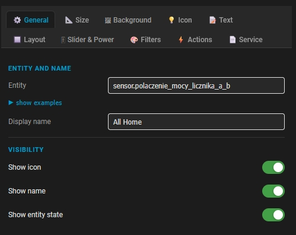
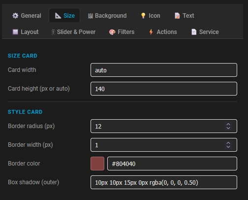
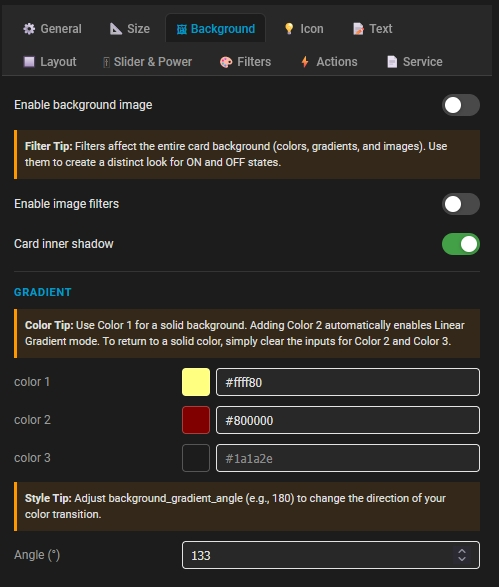
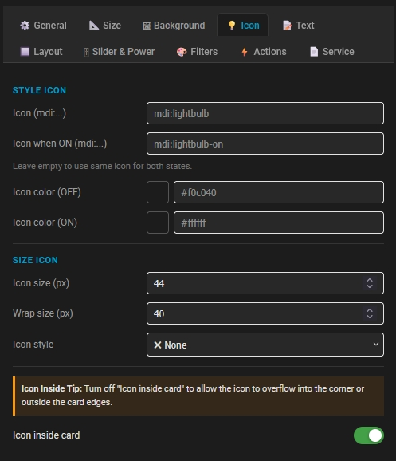
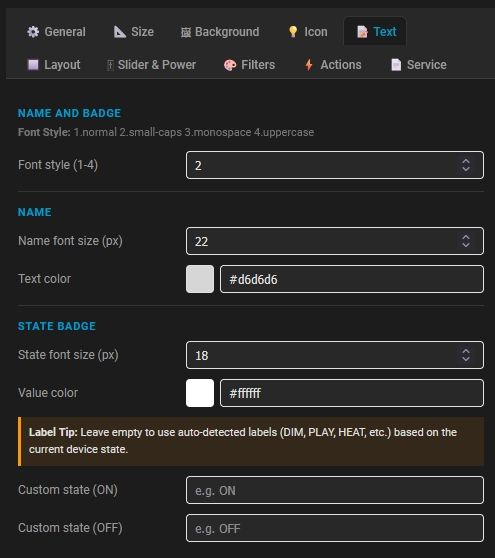
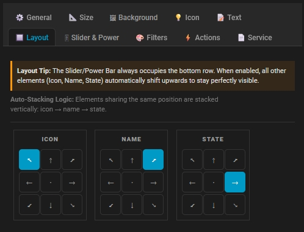
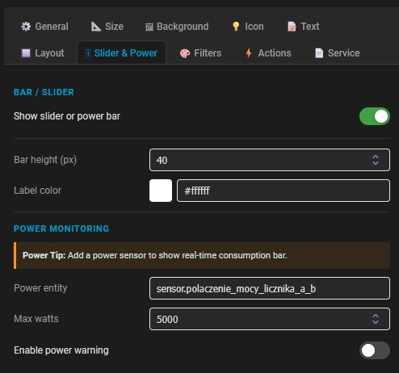
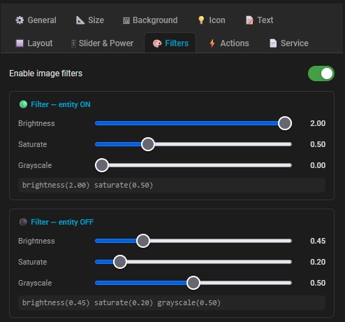
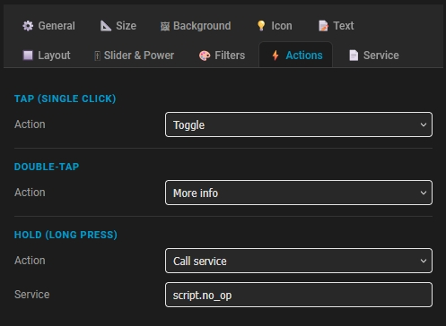
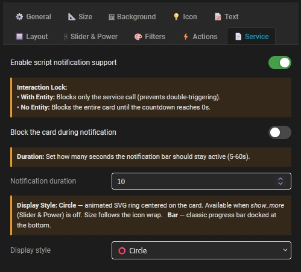

# 🖥 Visual Editor

> 🔙 Back to the [Main README](../README.md)

The Visual Editor allows configuring `custom:piotras-smart-button`
directly from the Home Assistant interface.

No manual YAML editing is required for the most common settings. The
editor groups options into clear sections and adapts available settings
depending on the selected entity.

------------------------------------------------------------------------

## 1. General

| General Configuration & Description | Preview |
| :--- | :--- |
| Configure primary settings and element visibility for the card.  **Entity and Name:** • **Entity:** Selects the Home Assistant object displayed or controlled by the card. • **Display name:** Sets a custom label for the card (e.g., `All Home`).  **Visibility Options:** • **Show icon:** Toggles icon visibility. • **Show name:** Toggles name visibility. • **Show entity state:** Toggles the state label visibility. |  |

------------------------------------------------------------------------

## 2. Size

| Size Configuration & Description | Preview |
| :--- | :--- |
| Adjust the card dimensions and outline styles to match your dashboard theme.  **Size Card:** • **Card width:** Sets the width of the card (e.g., `auto`). • **Card height (px or auto):** Sets the card height in pixels (e.g., `140`).  **Style Card:** • **Border radius (px):** Defines how rounded the corners are (e.g., `12`). • **Border width (px):** Sets the thickness of the border line (e.g., `1`). • **Border color:** Standard HEX color picker for the card outline (e.g., `#804040`). • **Box shadow (outer):** Advanced outer shadow effect using CSS styling. |  |

------------------------------------------------------------------------

## 3. Background

| Background Configuration & Description | Preview |
| :--- | :--- |
| Manage card background options, including solid colors, multi-color linear gradients, and image behavior.  **General Settings:** • **Enable background image:** Toggles the use of a background photo or texture. • **Enable image filters:** Activates custom visual filters (ideal for unique ON/OFF state styles). • **Card inner shadow:** Toggles the inner glow/shadow effect of the card background.  **Gradient Settings:** • **color 1 / 2 / 3:** Setting just `color 1` creates a solid color background. Adding `color 2` or `color 3` automatically triggers a Linear Gradient mode. • **Angle (°):** Controls the direction of the color transitions (e.g., `133`). |  |

------------------------------------------------------------------------

## 4. Icon

| Icon Configuration & Description | Preview |
| :--- | :--- |
| Customize the behavior, appearance, and placement of the icon for different device states.  **Style Icon:** • **Icon (mdi:...):** Sets the default icon name from the Material Design Icons library (e.g., `mdi:lightbulb`). • **Icon when ON (mdi:...):** Defines an alternative icon for the `ON` state (e.g., `mdi:lightbulb-on`). Leave empty to use the same icon for both states. • **Icon color (OFF) / (ON):** Assigns separate HEX colors for each state.  **Size Icon:** • **Icon size (px):** Sets the size of the icon itself (e.g., `44`). • **Wrap size (px):** Controls the dimensions of the icon's container bounding box. • **Icon style:** Applies pre-defined styles or custom shapes to the icon container. • **Icon inside card:** Toggles containment. Disabling this allows the icon to overflow outside the card boundaries or into the corners. |  |

------------------------------------------------------------------------

## 5. Text

| Text Configuration & Description | Preview |
| :--- | :--- |
| Manage typography, colors, and custom text labels for both the card name and state badges.  **Name and Badge:** • **Font style (1-4):** Selects the global text formatting style (`1.normal`, `2.small-caps`, `3.monospace`, `4.uppercase`).  **Name:** • **Name font size (px):** Sets the size of the main display name (e.g., `22`). • **Text color:** HEX color picker for the primary card title text.  **State Badge:** • **State font size (px):** Sets the text size for the device state label (e.g., `18`). • **Value color:** HEX color picker for the state text value. • **Custom state (ON) / (OFF):** Overrides default Home Assistant states with custom labels. Leave empty to auto-detect labels (like DIM, PLAY, HEAT) dynamically. |  |

------------------------------------------------------------------------

## 6. Layout

| Layout Configuration & Description | Preview |
| :--- | :--- |
| Position individual elements inside the card using an intuitive directional grid interface.  **Placement Grids:** • **Icon / Name / State:** Each element has its own 9-position grid switcher allowing you to anchor it to any corner, edge, or the center of the card.  **Layout Logic:** • **Auto-Stacking Logic:** Elements that share the exact same position on the grid will automatically stack vertically in a specific order: `icon` → `name` → `state`. • **Slider/Power Bar Behavior:** The Slider/Power Bar always occupies the bottom row. When it is enabled, all other elements automatically shift upwards to remain perfectly visible. |  |

------------------------------------------------------------------------

## 7. Slider & Power

| Slider & Power Configuration & Description | Preview |
| :--- | :--- |
| Integrate a functional slider or a real-time power consumption bar at the bottom of the card.  **Bar / Slider:** • **Show slider or power bar:** Toggles the visibility of the bottom bar element. • **Bar height (px):** Sets the vertical thickness of the bar (e.g., `40`). • **Label color:** Defines the HEX color code for text labels shown on the bar (e.g., `#ffffff`).  **Power Monitoring:** • **Power entity:** Selects the specific Home Assistant sensor tracking active energy usage (e.g., `sensor.polaczenie_mocy_licznika_a_b`). • **Max watts:** Defines the upper limit scaling for the consumption bar (e.g., `5000` watts). • **Enable power warning:** Toggles a visual alert indicator when energy consumption spikes or exceeds defined thresholds. |  |

------------------------------------------------------------------------

## 8. Filters

| Filters Configuration & Description | Preview |
| :--- | :--- |
| Apply dynamic CSS image filters to the card background depending on the entity's current state.  **General Switch:** • **Enable image filters:** Toggles the entire filter module on or off.  **Filter — entity ON:** • **Brightness:** Adjusts background brightness when active (e.g., `2.00`). • **Saturate:** Controls color saturation level (e.g., `0.50`). • **Grayscale:** Converts colors to shades of gray (e.g., `0.00`). • *Generated string:* `brightness(2.00) saturate(0.50)`  **Filter — entity OFF:** • **Brightness:** Dims or brightens background when inactive (e.g., `0.45`). • **Saturate:** Reduces or increases saturation when turned off (e.g., `0.20`). • **Grayscale:** Adds a gray effect for inactive state (e.g., `0.50`). • *Generated string:* `brightness(0.45) saturate(0.20) grayscale(0.50)` |  |

------------------------------------------------------------------------

## 9. Actions

| Actions Configuration & Description | Preview |
| :--- | :--- |
| Define what happens when a user interacts with the card using different touch or click gestures.  **Tap (Single Click):** • **Action:** Specifies the behavior for a standard single tap (e.g., `Toggle` to switch the device on/off).  **Double-Tap:** • **Action:** Specifies the behavior for a quick double click (e.g., `More info` to open the standard Home Assistant entity dialog).  **Hold (Long Press):** • **Action:** Specifies the behavior for pressing and holding the card (e.g., `Call service`). • **Service:** Defines the exact Home Assistant service or script triggered by the long press (e.g., `script.no_op`). |  |

------------------------------------------------------------------------

## 10. Service

| Service Configuration & Description | Preview |
| :--- | :--- |
| Configure visual notification feedback and card blocking mechanisms when triggering Home Assistant scripts.  **Notification Settings:** • **Enable script notification support:** Toggles the main notifications module for script execution triggers. • **Block the card during notification:** Prevents users from interacting with the card while a notification is active. • **Notification duration:** Sets the lifetime of the notification bar in seconds (range: `5-60s`, e.g., `10`). • **Display style:** Chooser for the feedback animation style: &nbsp;&nbsp;◦ `Circle` – Animated SVG ring centered on the card (follows icon wrap size, available when *show_more* under Slider & Power is off). &nbsp;&nbsp;◦ `Bar` – Classic progress bar docked at the bottom of the card.  **Interaction Lock Logic:** • **With Entity:** Blocks only the service call to prevent accidental double-triggering. • **No Entity:** Complete lock – blocks the entire card from any input until the countdown reaches `0s`. |  |

------------------------------------------------------------------------

# Tips

For best results:

-   use Layout for precise positioning
-   use Background for dashboard themes
-   use Icon styles for consistency
-   use Slider & Power for sensors and devices
-   use Actions for automations

The Visual Editor exposes the most common options while advanced YAML
configuration remains available for advanced users.

> 🔙 Back to the [Main README](../README.md)
