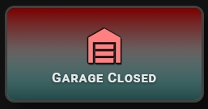
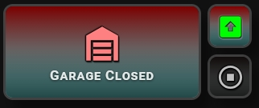
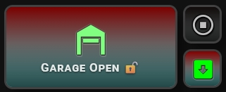

## 🚪 Entry Gate & Garage Control

> 🔙 Back to the [Main README](../README.md)

There is no dedicated "garage mode" built into the card — this layout is fully assembled from existing options: `custom_states_on` to control the active icon, `custom_blockade` to self-lock the card while the gate is in motion, `custom_states_labels` for dynamic status text, and separate small action-button cards using the Service Countdown for Open / Stop / Close.

#### 1. Closed — ready to open



#### 2. Opening — self-blocking while in motion



#### 3. Open — ready to close


#### 4. Closing — self-blocking while in motion



- **Status card** — main `cover` entity with icon swapping via `custom_states_on`, label text via `custom_states_labels`.
- **Self-locking** — `custom_blockade` disables all taps while the gate is `opening` or `closing`, preventing accidental re-triggering mid-motion.
- **Action buttons** — separate small cards for Open / Stop / Close, each calling its own `cover` service with a 3-second `circle` countdown for immediate tap feedback.

```yaml
# Status card
type: custom:piotras-smart-button
entity: cover.your_gate
icon: mdi:garage
icon_on: mdi:garage-open
icon_color: "#d32f2f"
icon_color_on: "#43d14a"
custom_states_on:
  - open
custom_states_labels:
  closed: "Garage Closed"
  open: "Garage Open 🔓"
  opening: "Going up! 🚀"
  closing: "Going down! 🔴"
custom_blockade:
  - opening
  - closing
tap_action:
  action: toggle
```

```yaml
# Open button
type: custom:piotras-smart-button
icon: mdi:arrow-up-bold-circle
icon_color_on: "#43d14a"
card_width: 60
card_height: 60
show_service: true
time_service: 3
service_style: circle
tap_action:
  action: call-service
  service: cover.open_cover
  service_data:
    entity_id: cover.your_gate
```

```yaml
# Stop button
type: custom:piotras-smart-button
icon: mdi:stop-circle
card_width: 60
card_height: 60
tap_action:
  action: call-service
  service: cover.stop_cover
  service_data:
    entity_id: cover.your_gate
```

```yaml
# Close button
type: custom:piotras-smart-button
icon: mdi:arrow-down-bold-circle
icon_color_on: "#ff5252"
card_width: 60
card_height: 60
show_service: true
time_service: 3
service_style: circle
tap_action:
  action: call-service
  service: cover.close_cover
  service_data:
    entity_id: cover.your_gate
```

Looking for more inspiration or advanced configurations for Entry Gate & Garage Control? Check out these community guides:

> 💬 [Community Dashboards & Showcases (Show and Tell)](https://github.com/Piotras1/piotras-smart-button/discussions/categories/show-and-tell)

> 🔙 Back to the [Main README](../README.md)
