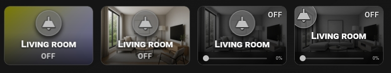
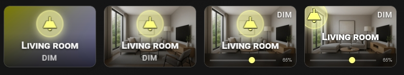
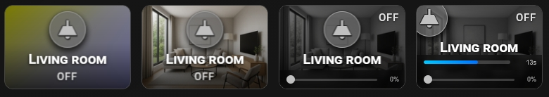

## 💡 Light & Auto-Dimmer Slider

When the card detects a `light` entity with brightness support, it automatically renders a brightness slider in the Control Zone — no extra configuration needed. Tap toggles the light. The slider adjusts brightness directly by dragging.

#### 1. Standard OFF State

#### 2. Active ON / Dimmed State

#### 3. OFF State with Active Service Timer

#### 4. Combined Dimmer Slider + Service Countdown Timer


- **Auto-detected** — no slider configuration needed, the card detects `brightness` automatically.
- **Live feedback** — slider position reflects current brightness in real time.
- **Countdown + slider** — `service_style: bar` renders the timer above the slider, both active at the same time.

```yaml
type: custom:piotras-smart-button
entity: light.your_light_entity
name: Living room
icon: mdi:ceiling-light
icon_color_on: "#ffff80"
card_width: 180
card_height: 120
border_width: 1
icon_size: 40
icon_wrap_size: 50
icon_color: "#c0c0c0"
font_style: 2
name_size: 20
state_size: 15
icon_mode: 1
name_mode: 5
value_mode: 3
show_image: true
show_filter: true
background_image_on: /local/your_background.jpg
show_more: true
show_icon_full: false
icon_over_size: 6.5
show_service: true
service_style: bar
time_service: 20
tap_action:
  action: toggle
hold_action:
  action: more-info
double_tap_action:
  action: call-service
  service: script.your_script
```

Looking for more inspiration or advanced configurations for Light & Auto-Dimmer Slider? Check out these community guides:
 
> 💬 [Community Dashboards & Showcases (Show and Tell)](https://github.com/Piotras1/piotras-smart-button/discussions/categories/show-and-tell)

> 🔙 Back to the [Main README](../README.md)
