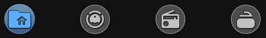

## 🧭 Navigation Mode (Neumorphic Style)

The card works equally well as a navigation controller — icon-only, circular, with a tactile press-and-hold feel.

Key features:

- **Active State Glow** — the current page highlights with a colored glow, immediately visible where you are.
- **Press & Hold feedback** — button stays visually pressed ~500ms before redirecting.
- **Minimalist look** — icon-only with `border_radius: 50` for a perfect circle, no clutter.
- **Still functional** — navigation buttons can still show background statuses (`show_service`, `entity_watts`) in real-time.




```yaml
type: custom:piotras-smart-button
icon: mdi:folder-home
icon_color: "#5badff"
show_filter: false
show_state: false
show_name: false
show_image: false
background_color1: "#5badff"
card_width: 70
card_height: 70
border_radius: 50
icon_size: 44
icon_wrap_size: 48
tap_action:
  action: navigate
  navigation_path: /dashboard-home/0
```


Looking for more inspiration or advanced configurations for Navigation Mode? Check out these community guides:

> 🧭 [Advanced Navigation Mode Guide (Extended Topic)](https://github.com/Piotras1/piotras-smart-button/discussions/2)
 
> 💬 [Community Dashboards & Showcases (Show and Tell)](https://github.com/Piotras1/piotras-smart-button/discussions/categories/show-and-tell)

> 🔙 Back to the [Main README](../README.md)
