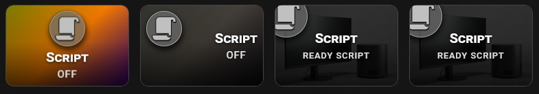

## 📜 Script Button

A dedicated layout for triggering scripts — no entity required. The card uses `name_on` and `name_off` to display custom state labels (e.g. "Ready Script" / "Progress Script") and shows an animated countdown immediately on tap.

Two countdown styles depending on layout:

- **`circle`** — SVG ring centered on the card, used when there is no entity and `show_more: false`. Ideal for icon-only or gradient background cards.
- **`bar`** — progress bar at the bottom, used alongside a background image.

Both styles can appear on different cards in the same dashboard simultaneously, each with its own `time_service` duration.




```yaml
type: custom:piotras-smart-button
name: Script
icon: mdi:script
card_width: 180
card_height: 120
border_width: 1
icon_size: 45
icon_wrap_size: 60
icon_color: "#c0c0c0"
font_style: 2
name_size: 20
state_size: 15
icon_mode: 1
name_mode: 5
value_mode: 5
show_service: true
time_service: 20
service_style: circle
show_filter: true
name_off: "Ready Script"
name_on: "Progress Script"
show_image: true
background_image_on: /local/your_image_on.png
background_image_off: /local/your_image_off.png
show_icon_full: false
tap_action:
  action: call-service
  service: script.your_script
```

Looking for more inspiration or advanced configurations for Script Button? Check out these community guides:
 
> 💬 [Community Dashboards & Showcases (Show and Tell)](https://github.com/Piotras1/piotras-smart-button/discussions/categories/show-and-tell)

> 🔙 Back to the [Main README](../README.md)
