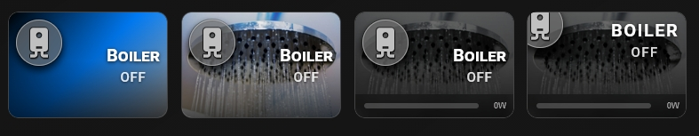
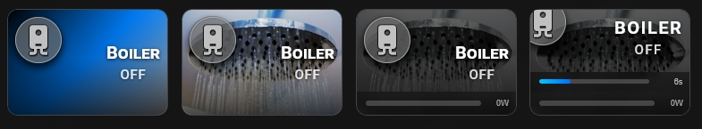

## 🎛️ Socket & Power Monitoring

Real-time power consumption bar for smart plugs and sockets. Tap toggles the socket on or off. Hold triggers an optional service call (e.g. a boiler heating script) with a countdown timer and card blockade.

### 🖼️ Interface States & Evolution

#### 1. Device Standard OFF State

#### 2. Card Blockade & Cooldown State

#### 3. Active ON State (Power Monitoring & Active Timer)


- **Dynamic Fill** — the power bar fills proportionally to `max_watts`.
- **Pulse Warning** — bar pulses when consumption exceeds `con_warning` (%). Set to `false` to disable.
- **Card Blockade** — when `blockade_card: true`, re-triggering the service call is blocked for the full timer duration. Tap actions (toggle, more-info) still work normally.

```yaml
type: custom:piotras-smart-button
entity: switch.your_socket_entity
entity_watts: sensor.your_power_sensor
name: Boiler
icon: mdi:water-boiler
icon_color_on: "#ff8080"
card_width: 180
card_height: 120
border_width: 1
icon_size: 40
icon_wrap_size: 50
icon_color: "#c0c0c0"
show_icon_full: false
icon_over_size: 4
font_style: 4
name_size: 20
state_size: 15
icon_mode: 1
name_mode: 3
value_mode: 3
show_image: true
background_image_on: /local/your_background.jpg
show_filter: true
show_more: true
con_warning: false
max_watts: 2000
show_service: true
time_service: 20
service_style: bar
blockade_card: true
tap_action:
  action: toggle
hold_action:
  action: call-service
  service: script.your_script
```

Looking for more inspiration or advanced configurations for Socket & Power Monitoring? Check out these community guides:
 
> 💬 [Community Dashboards & Showcases (Show and Tell)](https://github.com/Piotras1/piotras-smart-button/discussions/categories/show-and-tell)

> 🔙 Back to the [Main README](../README.md)
