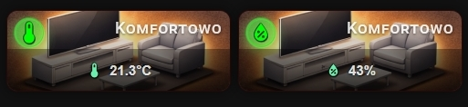

## 🌡️ Temperature & Humidity Comfort



When the card detects a `sensor` entity with `device_class: temperature` or `device_class: humidity`, it activates **comfort mode** — the card turns ON or OFF based on whether the current value falls within a configurable comfort range defined by `comfort_min` and `comfort_max`.

The main card icon also reacts — `mdi:thermometer` / `mdi:water-percent` when comfortable, `mdi:thermometer-alert` / `mdi:water-alert` when outside the range. You can override these with `icon` and `icon_on` as usual.

Temperature sensors reporting in **°F are automatically converted to °C** before the range check.

If `comfort_min` or `comfort_max` is not set, comfort mode is inactive and the card behaves as a standard read-only sensor card.

```yaml
type: custom:piotras-smart-button
entity: sensor.salon_temperature
name: Salon Temperature
show_more: true
comfort_min: 19
comfort_max: 25
name_on: Comfortable
name_off: No Comfort
icon_color: "#5bc8f5"
icon_color_on: "#69f0ae"
card_width: 180
card_height: 120
background_color1: "#8B4513"
background_color2: "#5C3317"
```

```yaml
type: custom:piotras-smart-button
entity: sensor.salon_humidity
name: Salon Humidity
show_more: true
comfort_min: 40
comfort_max: 60
name_on: Comfortable
name_off: No Comfort
icon_color: "#5bc8f5"
icon_color_on: "#69f0ae"
card_width: 180
card_height: 120
background_color1: "#2c3e6b"
background_color2: "#1a2a4a"
```

Looking for more inspiration or advanced configurations for Temperature & Humidity? Check out these community guides:
 
> 💬 [Community Dashboards & Showcases (Show and Tell)](https://github.com/Piotras1/piotras-smart-button/discussions/categories/show-and-tell)

> 🔙 Back to the [Main README](../README.md)
