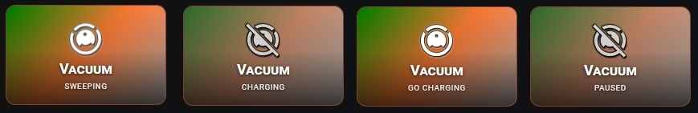

## 🧹 Smart Vacuum Status

Provide your standard Home Assistant vacuum entity (e.g., vacuum.your_vacuum) or a dedicated status sensor (e.g., sensor.dreame_mc1808_3504_status) to track your robotic cleaner. This layout is designed specifically to handle the messy, inconsistent, or poorly translated states returned by various hardware brands (Roborock, Xiaomi, Dreame, etc.).



- Flexible Entity Support — works seamlessly with both native vacuum. domain entities and standard sensor. state entities.
- Kinetic Icon Feedback — the vacuum icon dynamically spins in real time whenever the active status matches your cleaning states.
- Custom ON-State Logic (vacuum_states_on) — if the card doesn't reflect the active state correctly, simply list the exact attributes/states that should turn the card ON (e.g., sweeping, cleaning, go charging).
- Advanced State Mapping (vacuum_states_labels) — completely override system translations or raw device attributes to define your own custom labels for any state (e.g., mapping raw sweeping to SPRZĄTA or go charging to WRACA).

```yaml
type: custom:piotras-smart-button
entity: sensor.dreame_mc1808_3504_status
vacuum_states_on:
  - sweeping
  - go charging
vacuum_states_labels:
  sweeping: SPRZĄTA
  go charging: WRACA
  charging: ŁADOWANIE
  idle: GOTOWY
  paused: CZEKAM
name: Vacuum
icon_mode: 1
card_width: 200
icon_wrap_size: 38
icon_size: 34
icon_style: square_color
icon_color: "#d3d3d3"
icon_color_on: "#ffffff"
icon: mdi:robot-vacuum-off
icon_on: mdi:robot-vacuum
```

Looking for more inspiration or advanced configurations for Smart Vacuum Status? Check out these community guides:
 
> 💬 [Community Dashboards & Showcases (Show and Tell)](https://github.com/Piotras1/piotras-smart-button/discussions/categories/show-and-tell)

> 🔙 Back to the [Main README](../README.md)
