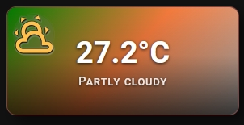

## 🌤️ Mini Weather Card

Provide any standard Home Assistant weather entity (e.g., weather.your_weather_entity) to enable a highly compact weather station dashboard. It automatically aggregates crucial meteorological data and translates raw attributes into a beautiful, scannable summary.




- Rich data layout — displays current temperature, weather conditions, humidity percentage, and wind speed simultaneously.
- Theme-matched icons — condition icons adapt their styling and color accents dynamically based on the current weather.
- Smart units — fully compatible with standard metric and imperial unit conversions out of the box.

```yaml
type: custom:piotras-smart-button
entity: weather.forecast_dom
icon_mode: 1
name_mode: 2
font_style: 2
name_size: 27
state_size: 14
icon_size: 38
icon_wrap_size: 40
card_width: 250
show_more: true
slider_height: 30
```

Looking for more inspiration or advanced configurations for Mini Weather Card? Check out these community guides:
 
> 💬 [Community Dashboards & Showcases (Show and Tell)](https://github.com/Piotras1/piotras-smart-button/discussions/categories/show-and-tell)

> 🔙 Back to the [Main README](../README.md)
