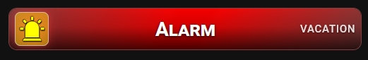
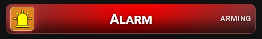

# 🔹 Advanced Alarm Status

A card for `alarm_control_panel` entities. It shows the alarm state as a short word and marks an active alarm with a glowing icon.




## What you get

- The card turns ON when the alarm is armed or active. It is OFF when the alarm is disarmed.
- The states that turn the card ON: `armed_home`, `armed_away`, `armed_night`, `armed_vacation`, `armed_custom_bypass`, `pending`, `arming` and `triggered`.
- The state badge shows a short word for each state, in the language of Home Assistant.
- In every ON state, the icon pulses with a red glow.
- The icon uses `icon_color` when the alarm is disarmed and `icon_color_on` in the ON states. You can set a different icon for the on state with `icon_on`.
- Tap toggles the entity. Double-tap and hold open more-info. For an alarm panel, you will usually want to set tap to **More info** in the **⚡ Actions** tab.
- These options work as usual: `name`, `icon`, `icon_style`, `tap_action`, `double_tap_action`, `hold_action`.

If you do not set `icon`, the card shows the default `mdi:lightning-bolt`.

## State badge texts

Languages: Polish, English, French, German, Spanish, Italian and Dutch. For any other language, the card uses English.

| State | English | Polish |
|---|---|---|
| `disarmed` | DISARMED | WYŁĄCZONY |
| `armed_home` | HOME | DOM |
| `armed_away` | AWAY | WYJŚCIE |
| `armed_night` | NIGHT | NOC |
| `armed_vacation` | VACATION | URLOP |
| `armed_custom_bypass` | CUSTOM | CUSTOM |
| `pending` | PENDING | OCZEKUJE |
| `arming` | ARMING | UZBRAJANIE |
| `triggered` | ALARM! | ALARM! |

For a state not on this list, for example `unavailable`, the badge shows the state in capital letters.

## Setup

No extra switch is needed. Enter the alarm entity in the **⚙️ General** tab and the card works.

The **📝 Text** tab has **Custom state (ON)** (`name_on`) and **Custom state (OFF)** (`name_off`). Fill in both. If both are set, they replace all the texts from the table above, so the badge shows only two texts: one for all ON states and one for disarmed. Leave them empty to keep the texts per state.

## Minimal example

```yaml
type: custom:piotras-smart-button
entity: alarm_control_panel.home
name: Alarm
icon: mdi:shield-home
tap_action:
  action: more-info
```

<details>
<summary>Full example</summary>

```yaml
type: custom:piotras-smart-button
entity: alarm_control_panel.home
name: Alarm
icon: mdi:shield-off
icon_on: mdi:shield-home
icon_color: "#f0c040"
icon_color_on: "#ff5252"
icon_style: circle_color
icon_size: 28
tap_action:
  action: more-info
double_tap_action:
  action: none
hold_action:
  action: more-info
card_width: 140
card_height: 120
```

</details>

## Go further

Everything above works from the visual editor. For special options, see the guides:

- 🏷️ [Custom State Labels](custom_states_labels_3.md) — your own text for each state
- 🎛️ [Custom States On & Blockade](custom_states_on_and_custom_blockade_3.md) — decide what counts as "on" and lock the card
- 👁️ [Conditional Visibility](visible_if_3.md) — show or hide the card
- 🧩 [Custom Data & Templates](custom_data_guide_3.md) — your own logic in JavaScript
- 🖱️ [Custom Tap](custom_tap_3.md) — clickable elements and your own panels
- ⚙️ [Configuration Reference](configuration_3.md) — the full list of options

## More ideas

> 💬 [Show and Tell](https://github.com/Piotras1/piotras-smart-button/discussions/categories/show-and-tell)

> 🔙 Back to the [Main README](../README_3.md)
