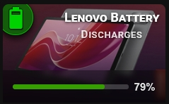
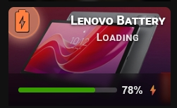

# 🔹 Battery

A card for battery sensors. It works with any entity that has `device_class: battery`, for example a phone or tablet battery sensor.




## What you get

- The icon changes with the charge level, from `mdi:battery-10` up to `mdi:battery`. Below 5% it shows `mdi:battery-alert`.
- The icon changes to `mdi:battery-charging` when the device is charging. For this you need the extra entity `entity_battery_state` (see below).
- The icon uses `icon_color` when the device is not charging and `icon_color_on` when it is charging.
- A bar at the bottom of the card shows the charge in percent. The bar color goes from red (empty) to green (full). A `⚡` sign appears next to the percent when the device is charging. The bar appears when you switch on the slider bar.
- The state badge shows `ON` when the device is charging and `OFF` in every other case.
- Tap toggles the entity. Double-tap and hold open more-info. For a sensor, you will usually want to change tap to **More info** in the **⚡ Actions** tab.
- These options work as usual: `name`, `name_on`, `name_off`, `icon_style`, `tap_action`, `double_tap_action`, `hold_action`.

The icon is chosen by the card. The **💡 Icon** tab does not offer `icon` and `icon_on` for battery entities.

## Setup

Open the **🎚 Slider & Power** tab and switch on **Show slider or power bar** (`show_more: true`). Without it, the percent bar is not shown.

In the same tab, the **Battery** section has one field: **Battery state entity** (`entity_battery_state`). Enter the sensor that reports the charging state. Without it, the card never shows charging, the charging icon, the `⚡` sign or the ON state.

You can also set the **Bar height** (`slider_height`, 16–60 px) and the **Label color** (`slider_label_color`) in the same tab.

To change the state text, use the **📝 Text** tab: **Custom state (ON)** (`name_on`) and **Custom state (OFF)** (`name_off`). For example, `Charging` and `On battery`. Fill in both. If only one is set, the card ignores them.

### Extra entities

| Option | What it is for |
|---|---|
| `entity_battery_state` | Charging state sensor. The card reacts to the state `charging`. Other states: `discharging`, `full`, `not_charging` |

## Minimal example

```yaml
type: custom:piotras-smart-button
entity: sensor.phone_battery
name: Phone
show_more: true
entity_battery_state: sensor.phone_battery_state
```

<details>
<summary>Full example</summary>

```yaml
type: custom:piotras-smart-button
entity: sensor.phone_battery
name: Phone
icon_color: "#f0c040"
icon_color_on: "#69f0ae"
icon_style: circle_color
icon_size: 28
name_on: Charging
name_off: On battery
show_more: true
entity_battery_state: sensor.phone_battery_state
slider_height: 30
slider_label_color: "rgba(255,255,255,0.85)"
card_width: 140
card_height: 120
tap_action:
  action: more-info
double_tap_action:
  action: none
hold_action:
  action: more-info
```

</details>

## Go further

Everything above works from the visual editor. For special options, see the guides:

- 🏷️ [Custom State Labels](custom_states_labels_3.md) — your own text for each state
- 🎛️ [Custom States On & Blockade](custom_states_on_and_custom_blockade_3.md) — decide what counts as "on" and lock the card
- 👁️ [Conditional Visibility](visible_if_3.md) — show or hide the card
- 🧩 [Custom Data & Templates](custom_data_guide_3.md) — your own logic in JavaScript
- 🖱️ [Custom Tap](custom_tap_3.md) — clickable elements and your own panels
- ⚙️ [Configuration Reference](configuration_3.md) — the full list of options

## More ideas

> 💬 [Show and Tell](https://github.com/Piotras1/piotras-smart-button/discussions/categories/show-and-tell)

> 🔙 Back to the [Main README](../README_3.md)
