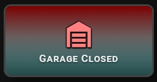
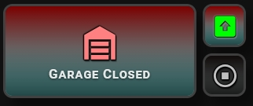

# 🔹 Garage Door & Cover

A card for `cover` entities, such as a garage door, a gate or a blind. It shows whether the cover is open and adds a position slider when the cover reports its position.




## What you get

- The card turns ON when the cover state is `open`. In every other state it is OFF, including `closed`, `opening` and `closing`.
- The icon uses `icon_color` when the card is off and `icon_color_on` when it is on. You can set a different icon for the on state with `icon_on`.
- The state badge shows `CLOSED` when the card is off.
- When the card is on, the badge shows `OPEN`. If the cover reports its position and the position is 50% or less, the badge shows `CLOSING`.
- A position slider (0–100%) appears automatically if the cover reports `current_position`. It appears when you switch on the slider bar.
- Tap toggles the cover. Double-tap and hold do nothing by default. You can set all three in the **⚡ Actions** tab.
- These options work as usual: `name`, `name_on`, `name_off`, `icon`, `icon_on`, `icon_style`, `tap_action`, `double_tap_action`, `hold_action`.

If you do not set `icon`, the card shows the default `mdi:lightning-bolt`. Set `icon` to something that fits, for example `mdi:garage`.

## Setup

For the position slider, open the **🎚 Slider & Power** tab and switch on **Show slider or power bar** (`show_more: true`). Without it, the slider is not shown. A cover that does not report its position has no slider.

In the same tab you can set the **Bar height** (`slider_height`, 16–60 px) and the **Label color** (`slider_label_color`).

To change the state text, use the **📝 Text** tab: **Custom state (ON)** (`name_on`) and **Custom state (OFF)** (`name_off`). For example, `Open` and `Closed`. Fill in both. If only one is set, the card ignores them.

## Minimal example

```yaml
type: custom:piotras-smart-button
entity: cover.garage_door
name: Garage
icon: mdi:garage
show_more: true
```

<details>
<summary>Full example</summary>

```yaml
type: custom:piotras-smart-button
entity: cover.garage_door
name: Garage
icon: mdi:garage
icon_on: mdi:garage-open
icon_color: "#f0c040"
icon_color_on: "#ff7043"
icon_style: circle_color
icon_size: 28
name_on: Open
name_off: Closed
show_more: true
slider_height: 30
slider_label_color: "rgba(255,255,255,0.85)"
card_width: 140
card_height: 120
tap_action:
  action: toggle
double_tap_action:
  action: more-info
hold_action:
  action: more-info
```

</details>

## Go further

Everything above works from the visual editor. For special options, see the guides:

- 🏷️ [Custom State Labels](custom_states_labels_3.md) — your own text for each state
- 🎛️ [Custom States On & Blockade](custom_states_on_and_custom_blockade_3.md) — decide what counts as "on" and lock the card
- 👁️ [Conditional Visibility](visible_if_3.md) — show or hide the card
- 🧩 [Custom Data & Templates](custom_data_guide_3.md) — your own logic in JavaScript
- 🖱️ [Custom Tap](custom_tap_3.md) — clickable elements and your own panels
- ⚙️ [Configuration Reference](configuration_3.md) — the full list of options

## More ideas

> 💬 [Show and Tell](https://github.com/Piotras1/piotras-smart-button/discussions/categories/show-and-tell)

> 🔙 Back to the [Main README](../README_3.md)
