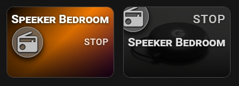
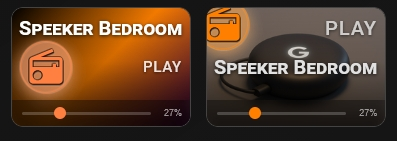

# 🔹 Media Player

A card for `media_player` entities. It shows whether the player is playing and adds a volume slider and player buttons.




## What you get

- The card turns ON when the player is playing. The state badge shows `PLAY` when it is playing and `STOP` in every other state, including paused and idle.
- The icon uses `icon_color` when the card is off and `icon_color_on` when it is on. You can set a different icon for the on state with `icon_on`.
- A volume slider (0–100%) appears automatically if the player reports its volume. It appears when you switch on the slider bar.
- Player buttons appear when you switch on **Show player buttons**: previous, play/pause, next and power.
- When the player is off or unavailable, the player bar shows only the power button. It turns the player on. The volume slider is hidden.
- Three layouts for the player bar. You can also change the height of the bar.
- Tap toggles the player. Double-tap and hold open more-info. You can change all three in the **⚡ Actions** tab.
- These options work as usual: `name`, `name_on`, `name_off`, `icon`, `icon_on`, `icon_style`, `tap_action`, `double_tap_action`, `hold_action`.

If you do not set `icon`, the card shows the default `mdi:lightning-bolt`. Set `icon` to something that fits, for example `mdi:speaker`.

## Setup

Open the **🎚 Slider & Power** tab. There are two toggles:

- **Show slider or power bar** (`show_more: true`) — shows the volume slider.
- **Show player buttons** (`show_player: true`) — shows the player buttons.

You can use one toggle or both. When both are on, the **Player bar layout** (`player_mode`) option appears:

| Value | Layout |
|---|---|
| `1` | Volume slider at the bottom, buttons above it |
| `2` | Buttons on the left, volume on the right, in one row |
| `3` | Volume on the left, buttons on the right, in one row |

If only **Show player buttons** is on, the buttons are shown without the volume slider and the layout option is hidden.

Other options in the same tab:

- **Player bar height** (`player_height`, 16–80 px, default 28) — changes the size of the buttons.
- **Bar height** (`slider_height`, 16–60 px) and **Label color** (`slider_label_color`) — the volume slider.

To change the state text, use the **📝 Text** tab: **Custom state (ON)** (`name_on`) and **Custom state (OFF)** (`name_off`). For example, `Playing` and `Silent`. Fill in both. If only one is set, the card ignores them.

## Minimal example

```yaml
type: custom:piotras-smart-button
entity: media_player.living_room
name: Living Room
icon: mdi:speaker
show_more: true
show_player: true
```

<details>
<summary>Full example</summary>

```yaml
type: custom:piotras-smart-button
entity: media_player.living_room
name: Living Room
icon: mdi:speaker
icon_on: mdi:speaker-wireless
icon_color: "#f0c040"
icon_color_on: "#ffffff"
icon_style: circle_color
icon_size: 28
name_on: Playing
name_off: Silent
show_more: true
show_player: true
player_mode: 2
player_height: 28
slider_height: 30
slider_label_color: "rgba(255,255,255,0.85)"
card_width: 200
card_height: 140
tap_action:
  action: toggle
double_tap_action:
  action: more-info
hold_action:
  action: more-info
```

</details>

## Go further

Everything above works from the visual editor. For special options, see the guides:

- 🏷️ [Custom State Labels](custom_states_labels_3.md) — your own text for each state
- 🎛️ [Custom States On & Blockade](custom_states_on_and_custom_blockade_3.md) — decide what counts as "on" and lock the card
- 👁️ [Conditional Visibility](visible_if_3.md) — show or hide the card
- 🧩 [Custom Data & Templates](custom_data_guide_3.md) — your own logic in JavaScript
- 🖱️ [Custom Tap](custom_tap_3.md) — clickable elements and your own panels
- ⚙️ [Configuration Reference](configuration_3.md) — the full list of options

## More ideas

> 💬 [Show and Tell](https://github.com/Piotras1/piotras-smart-button/discussions/categories/show-and-tell)

> 🔙 Back to the [Main README](../README_3.md)
