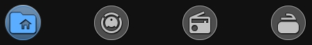
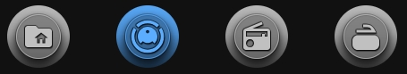

# 🔹 Navigation Mode (Neumorphic Style)

A round button that opens another dashboard view. You place a row of these buttons on every view to make a menu. The button for the current view is highlighted.




## What you get

- A button that opens a path in Home Assistant, for example `/dashboard-home/home`. It does not need an entity.
- A circle, when you set the card to a square size and `border_radius` to `50`.
- A highlight for the current view: a bright `icon_color` and a bigger `icon_size`. The other buttons stay gray and smaller.
- A short delay before it navigates. The card waits about 0.25 seconds after a tap to see whether it is a double-tap.
- Navigation on tap, double-tap or hold. You set each one in the **⚡ Actions** tab.
- An optional entity. If you add `entity`, the button can also show the state of a device in the background, with `icon_color_on` and the other options from the device guides.

Without an entity, the card is always in its OFF state. This is why `icon_color` is the color you see on a navigation button.

The card does not know which view is open. You set the highlight by hand on each view (see Setup).

## Setup

**Navigation.** Open the **⚡ Actions** tab. In the **Tap (single click)** block, set **Action** to **Navigate** and type the path in **Navigation path** (`navigation_path`). The path is the part of the browser address after your Home Assistant address, for example `/lovelace/0` or `/dashboard-home/home`.

**Show only the icon.** Open the **⚙️ General** tab. In the **Visibility** section, switch off **Show name** (`show_name: false`) and **Show entity state** (`show_state: false`).

**Round shape.** Open the **📐 Size** tab:

- **Card width** (`card_width`) and **Card height** (`card_height`) — the same value, for example `60`.
- **Border radius (px)** (`border_radius`) — `50` makes a circle.

**Icon.** Open the **💡 Icon** tab:

- **Icon (mdi:...)** (`icon`) — the icon of the button.
- **Icon color (OFF)** (`icon_color`) — the color of the button. Use a bright color for the active button, for example `#80ff00`, and a gray for the others, for example `#dadada`.
- **Icon size (px)** (`icon_size`) — use a bigger value for the active button, for example `45`, and a smaller one for the others, for example `35`.
- **Wrap size (px)** (`icon_wrap_size`) — keep the same value on all buttons, for example `50`, so the menu does not change size.

**Background.** Open the **🖼 Background** tab. Under **Gradient**, set **color 1** (`background_color1`). With only color 1, the background is solid.

**Menu on every view.** Add the same group of buttons to every view. On each view, give the button of that view the active settings (bright `icon_color`, bigger `icon_size`). Give all the other buttons the inactive settings. The full example shows two views.

## Minimal example

```yaml
type: custom:piotras-smart-button
icon: mdi:folder-home
show_name: false
show_state: false
tap_action:
  action: navigate
  navigation_path: /dashboard-home/home
```

<details>
<summary>Full example</summary>

Two views, "Home" and "Climate". Each view has the same two buttons. Only the highlight changes.

**View "Home": Home is active, Climate is inactive.**

Home button (active):

```yaml
type: custom:piotras-smart-button
icon: mdi:folder-home
icon_color: "#80ff00"
show_state: false
show_name: false
background_color1: "#ffffff"
card_width: 60
card_height: 60
border_radius: 50
icon_size: 45
icon_wrap_size: 50
tap_action:
  action: navigate
  navigation_path: /dashboard-home/home
```

Climate button (inactive):

```yaml
type: custom:piotras-smart-button
icon: mdi:home-thermometer-outline
icon_color: "#dadada"
show_state: false
show_name: false
background_color1: "#ffffff"
card_width: 60
card_height: 60
border_radius: 50
icon_size: 35
icon_wrap_size: 50
tap_action:
  action: navigate
  navigation_path: /dashboard-home/climate
```

**View "Climate": Climate is active, Home is inactive.**

Home button (inactive):

```yaml
type: custom:piotras-smart-button
icon: mdi:folder-home
icon_color: "#dadada"
show_state: false
show_name: false
background_color1: "#ffffff"
card_width: 60
card_height: 60
border_radius: 50
icon_size: 35
icon_wrap_size: 50
tap_action:
  action: navigate
  navigation_path: /dashboard-home/home
```

Climate button (active):

```yaml
type: custom:piotras-smart-button
icon: mdi:home-thermometer-outline
icon_color: "#80ff00"
show_state: false
show_name: false
background_color1: "#ffffff"
card_width: 60
card_height: 60
border_radius: 50
icon_size: 45
icon_wrap_size: 50
tap_action:
  action: navigate
  navigation_path: /dashboard-home/climate
```

</details>

## Go further

Everything above works from the visual editor. For special options, see the guides:

- 🏷️ [Custom State Labels](custom_states_labels_3.md) — your own text for each state
- 🎛️ [Custom States On & Blockade](custom_states_on_and_custom_blockade_3.md) — decide what counts as "on" and lock the card
- 👁️ [Conditional Visibility](visible_if_3.md) — show or hide the card
- 🧩 [Custom Data & Templates](custom_data_guide_3.md) — your own logic in JavaScript
- 🖱️ [Custom Tap](custom_tap_3.md) — clickable elements and your own panels
- ⚙️ [Configuration Reference](configuration_3.md) — the full list of options

## More ideas

If you built a menu with this card, share it:

> 💬 [Show and Tell](https://github.com/Piotras1/piotras-smart-button/discussions/categories/show-and-tell)

> 🔙 Back to the [Main README](../README_3.md)
