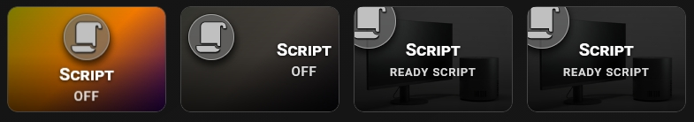
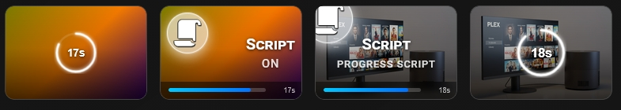

# 🔹 Script Button

A button that runs a script or any Home Assistant service. It works with `script` entities and also without an entity. After the tap, it can show a countdown.




## What you get

- Tap runs the service you choose in the **⚡ Actions** tab. Pick **Call service** and enter the service name, for example `script.good_night`.
- With a `script` entity, the card shows the script state: ON while the script runs, OFF when it is idle. The state badge shows `ON` or `OFF`.
- Without an entity, the card has no state. It still runs the service and shows the countdown.
- An optional countdown shows that the script was started. It is a ring in the middle of the card or a bar at the bottom.
- An optional lock stops a second tap while the countdown runs.
- The icon uses `icon_color` when the card is off and `icon_color_on` when it is on. You can set a different icon for the on state with `icon_on`.
- These options work as usual: `name`, `name_on`, `name_off`, `icon`, `icon_style`, `tap_action`, `double_tap_action`, `hold_action`.

If you do not set `icon`, the card shows the default `mdi:lightning-bolt`.

## Setup

**Run a service.** Open the **⚡ Actions** tab. In the **Tap (single click)** block, set **Action** to **Call service** and type the service in **Service**. You can do the same for double-tap and hold.

**Show a countdown.** Open the **📄 Service** tab and switch on **Enable script notification support** (`show_service: true`). Then set:

- **Block the card during notification** (`blockade_card`) — locks the card during the countdown. With an entity, the lock stops only the service call, so a second tap does not run the script twice. Without an entity, the lock blocks the whole card until the countdown ends.
- **Notification duration** (`time_service`) — how long the countdown runs, in seconds. Range in the editor: 5–60. Default: 10.
- **Display style** (`service_style`) — `circle` or `bar`.

| Display style | What you see |
|---|---|
| `circle` (default) | A ring in the middle of the card, with the seconds left. Available only when **Show slider or power bar** (`show_more`) is off |
| `bar` | A progress bar at the bottom of the card, with the seconds left |

When `show_more` is on, the card always uses the bar, and the editor shows it as fixed.

The countdown starts only when the action is **Call service**. A tap with **Toggle** does not start it.

To change the state text, use the **📝 Text** tab: **Custom state (ON)** (`name_on`) and **Custom state (OFF)** (`name_off`). For example, `Running` and `Ready`. Fill in both. If only one is set, the card ignores them.

## Minimal example

```yaml
type: custom:piotras-smart-button
entity: script.good_night
name: Good Night
icon: mdi:weather-night
tap_action:
  action: call-service
  service: script.good_night
show_service: true
```

<details>
<summary>Full example</summary>

```yaml
type: custom:piotras-smart-button
entity: script.good_night
name: Good Night
icon: mdi:weather-night
icon_on: mdi:weather-night
icon_color: "#f0c040"
icon_color_on: "#ffffff"
icon_style: circle_color
icon_size: 28
name_on: Running
name_off: Ready
tap_action:
  action: call-service
  service: script.good_night
double_tap_action:
  action: more-info
hold_action:
  action: more-info
show_service: true
blockade_card: true
time_service: 15
service_style: circle
card_width: 140
card_height: 120
```

</details>

## Go further

Everything above works from the visual editor. For special options, see the guides:

- 🏷️ [Custom State Labels](custom_states_labels_3.md) — your own text for each state
- 🎛️ [Custom States On & Blockade](custom_states_on_and_custom_blockade_3.md) — decide what counts as "on" and lock the card
- 👁️ [Conditional Visibility](visible_if_3.md) — show or hide the card
- 🧩 [Custom Data & Templates](custom_data_guide_3.md) — your own logic in JavaScript
- 🖱️ [Custom Tap](custom_tap_3.md) — clickable elements and your own panels
- ⚙️ [Configuration Reference](configuration_3.md) — the full list of options

## More ideas

> 💬 [Show and Tell](https://github.com/Piotras1/piotras-smart-button/discussions/categories/show-and-tell)

> 🔙 Back to the [Main README](../README_3.md)
