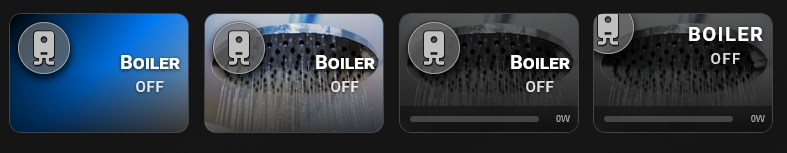
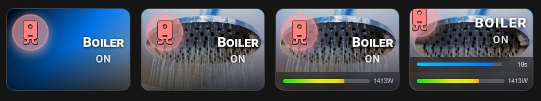

# 🔹 Socket & Power Monitoring

A card for smart sockets. It works with `switch` entities and shows a live power bar when you add a power sensor.




## What you get

- Tap toggles the socket. Double-tap and hold open more-info. You can change all three in the **⚡ Actions** tab.
- The state badge shows `ON` or `OFF`.
- The icon uses `icon_color` when the socket is off and `icon_color_on` when it is on. You can set a different icon for the on state with `icon_on`.
- A power bar appears at the bottom of the card when you add a power sensor. The label shows the current value in watts, for example `120W`.
- The bar fills from green through yellow to red. It fills up to the value set in `max_watts`.
- When the bar passes the warning level, it pulses.
- These options work as usual: `name`, `name_on`, `name_off`, `icon`, `icon_style`, `tap_action`, `double_tap_action`, `hold_action`.

## Setup

Open the **🎚 Slider & Power** tab and switch on **Show slider or power bar** (`show_more: true`). Then fill in the power section:

- **Power entity** (`entity_watts`) — the power sensor of the socket.
- **Max watts** (`max_watts`) — the value that fills the whole bar. Range in the editor: 100–10000. Default: 2000.
- **Enable power warning** — turns the pulsing warning on or off. If you turn it off, the card saves `con_warning: false`.
- **Warning at %** (`con_warning`) — the bar pulses when it is filled above this level. Range in the editor: 1–100. Default: 80.

You can also set the **Bar height** (`slider_height`) and the **Label color** (`slider_label_color`) in the same tab.

To change the state text, use the **📝 Text** tab: **Custom state (ON)** (`name_on`) and **Custom state (OFF)** (`name_off`). Fill in both. If only one is set, the card ignores them.

### Extra entities

| Option | What it is for |
|---|---|
| `entity_watts` | Power sensor (in watts) for the consumption bar |

## Minimal example

```yaml
type: custom:piotras-smart-button
entity: switch.socket_1
name: Washing Machine
show_more: true
entity_watts: sensor.socket_1_power
```

<details>
<summary>Full example</summary>

```yaml
type: custom:piotras-smart-button
entity: switch.socket_1
name: Washing Machine
icon: mdi:washing-machine
icon_on: mdi:washing-machine
icon_color: "#f0c040"
icon_color_on: "#ffffff"
icon_style: circle_color
name_on: Running
name_off: Idle
show_more: true
entity_watts: sensor.socket_1_power
max_watts: 2200
con_warning: 85
slider_height: 30
slider_label_color: "rgba(255,255,255,0.85)"
card_width: 140
card_height: 120
tap_action:
  action: toggle
double_tap_action:
  action: more-info
hold_action:
  action: more-info
```

</details>

## Go further

Everything above works from the visual editor. For special options, see the guides:

- 🏷️ [Custom State Labels](custom_states_labels_3.md) — your own text for each state
- 🎛️ [Custom States On & Blockade](custom_states_on_and_custom_blockade_3.md) — decide what counts as "on" and lock the card
- 👁️ [Conditional Visibility](visible_if_3.md) — show or hide the card
- 🧩 [Custom Data & Templates](custom_data_guide_3.md) — your own logic in JavaScript
- 🖱️ [Custom Tap](custom_tap_3.md) — clickable elements and your own panels
- ⚙️ [Configuration Reference](configuration_3.md) — the full list of options

## More ideas

> 💬 [Show and Tell](https://github.com/Piotras1/piotras-smart-button/discussions/categories/show-and-tell)

> 🔙 Back to the [Main README](../README_3.md)
