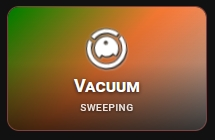
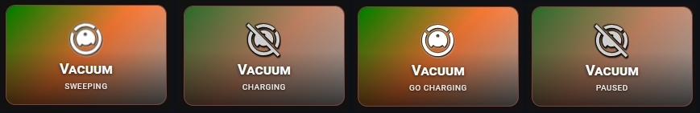

# 🔹 Vacuum

A card for `vacuum` entities. It shows what the robot is doing with a short word and a moving icon.




## What you get

- The card turns ON when the vacuum is cleaning or returning to the dock. In every other state it is OFF.
- While the vacuum is cleaning, the icon swings left and right.
- The icon uses `icon_color` when the card is off and `icon_color_on` when it is on. You can set a different icon for the on state with `icon_on`.
- The state badge shows a short word for each state, in the language of Home Assistant.
- Tap toggles the entity. Double-tap and hold do nothing by default. You can set all three in the **⚡ Actions** tab.
- These options work as usual: `name`, `icon`, `icon_style`, `tap_action`, `double_tap_action`, `hold_action`.

If you do not set `icon`, the card shows the default `mdi:lightning-bolt`. Set `icon` to something that fits, for example `mdi:robot-vacuum`.

## State badge texts

Languages: Polish, English, German, French, Spanish, Italian and Dutch. For any other language, the card uses English.

| State | English | Polish |
|---|---|---|
| `cleaning` | CLEANING | SPRZĄTA |
| `docked` | DOCKED | ZADOKOWANY |
| `returning` | RETURNING | WRACA |
| `paused` | PAUSED | PAUZA |
| `idle` | IDLE | GOTOWY |
| `error` | ERROR | BŁĄD |
| `charging` | CHARGING | ŁADUJE |

For a state not on this list, the badge shows the state in capital letters.

## Setup

No extra switch is needed. Enter the vacuum entity in the **⚙️ General** tab and the card works.

The **📝 Text** tab has **Custom state (ON)** (`name_on`) and **Custom state (OFF)** (`name_off`). Fill in both. If both are set, they replace all the texts from the table above, so the badge shows only two texts: one for cleaning and returning, and one for all other states. Leave them empty to keep the texts per state.

## Minimal example

```yaml
type: custom:piotras-smart-button
entity: vacuum.robot
name: Robot
icon: mdi:robot-vacuum
```

<details>
<summary>Full example</summary>

```yaml
type: custom:piotras-smart-button
entity: vacuum.robot
name: Robot
icon: mdi:robot-vacuum
icon_on: mdi:robot-vacuum
icon_color: "#f0c040"
icon_color_on: "#69f0ae"
icon_style: circle_color
icon_size: 28
tap_action:
  action: toggle
double_tap_action:
  action: more-info
hold_action:
  action: more-info
card_width: 140
card_height: 120
```

</details>

## Go further

Everything above works from the visual editor. For special options, see the guides:

- 🏷️ [Custom State Labels](custom_states_labels_3.md) — your own text for each state
- 🎛️ [Custom States On & Blockade](custom_states_on_and_custom_blockade_3.md) — decide what counts as "on" and lock the card
- 👁️ [Conditional Visibility](visible_if_3.md) — show or hide the card
- 🧩 [Custom Data & Templates](custom_data_guide_3.md) — your own logic in JavaScript
- 🖱️ [Custom Tap](custom_tap_3.md) — clickable elements and your own panels
- ⚙️ [Configuration Reference](configuration_3.md) — the full list of options

## More ideas

> 💬 [Show and Tell](https://github.com/Piotras1/piotras-smart-button/discussions/categories/show-and-tell)

> 🔙 Back to the [Main README](../README_3.md)
