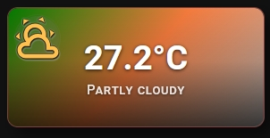
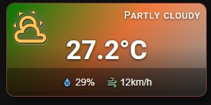

# 🔹 Mini Weather Card

A card for `weather` entities. It shows the current temperature, the weather condition and, if you want, humidity and wind.




## What you get

- The card switches to weather mode on its own when the entity starts with `weather.`.
- The temperature replaces the name. It shows one decimal place and the unit from the weather entity, for example `21.5°C`. You set its size with **Name font size** in the **📝 Text** tab.
- The icon follows the weather condition, for example `mdi:weather-sunny`, `mdi:weather-rainy` or `mdi:weather-snowy`. For an unknown condition, the card shows `mdi:weather-cloudy`. You can replace it with your own `icon`.
- The icon color can follow the condition too: gold for sunny, blue for rainy, light blue for snowy, and so on. To turn this on, set **Icon color (OFF)** (`icon_color`) to `auto` with the **A** button in the **💡 Icon** tab. A color you pick yourself is used for every condition.
- The state badge shows the weather condition as a word, in the language of Home Assistant.
- A bar at the bottom of the card shows humidity and wind speed, for example `60%` and `12 km/h`. If a value is missing, the bar shows `--`. The bar appears when you switch on the slider bar.
- Tap, double-tap and hold open more-info for the weather entity. You can change them in the **⚡ Actions** tab. The **Toggle** action also opens more-info.
- These options work as usual: `icon_style`, `tap_action`, `double_tap_action`, `hold_action`, `show_state`.

The `name` option does not show on this card, because the temperature takes its place.

## Setup

Open the **🎚 Slider & Power** tab and switch on **Show slider or power bar** (`show_more: true`). It shows humidity and wind. Without it, the bar is hidden.

In the same tab you can set the **Bar height** (`slider_height`, 16–60 px) and the **Label color** (`slider_label_color`).

## Minimal example

```yaml
type: custom:piotras-smart-button
entity: weather.home
icon_color: auto
show_more: true
```

<details>
<summary>Full example</summary>

```yaml
type: custom:piotras-smart-button
entity: weather.home
icon_color: auto
icon_style: circle_color
icon_size: 28
name_size: 24
show_state: true
show_more: true
slider_height: 30
slider_label_color: "rgba(255,255,255,0.85)"
card_width: 140
card_height: 140
tap_action:
  action: more-info
double_tap_action:
  action: none
hold_action:
  action: more-info
```

</details>

## Go further

Everything above works from the visual editor. For special options, see the guides:

- 🏷️ [Custom State Labels](custom_states_labels_3.md) — your own text for each state
- 🎛️ [Custom States On & Blockade](custom_states_on_and_custom_blockade_3.md) — decide what counts as "on" and lock the card
- 👁️ [Conditional Visibility](visible_if_3.md) — show or hide the card
- 🧩 [Custom Data & Templates](custom_data_guide_3.md) — your own logic in JavaScript
- 🖱️ [Custom Tap](custom_tap_3.md) — clickable elements and your own panels
- ⚙️ [Configuration Reference](configuration_3.md) — the full list of options

## More ideas

> 💬 [Show and Tell](https://github.com/Piotras1/piotras-smart-button/discussions/categories/show-and-tell)

> 🔙 Back to the [Main README](../README_3.md)
